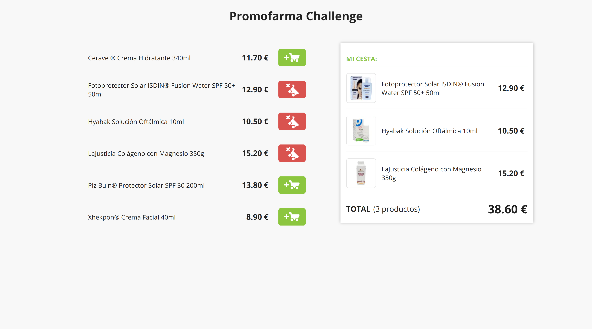
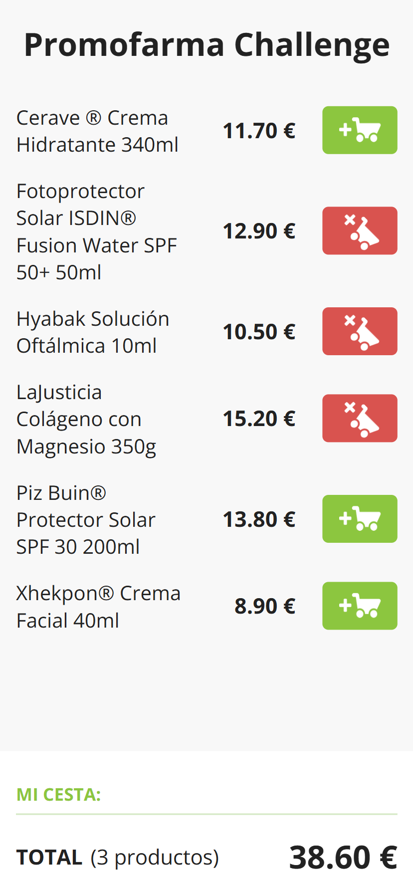

# 💊 Promofarma Challenge

This is a technical test implementation for Promofarma. It consists of a responsive product listing page and a shopping cart component, based on provided desktop and mobile designs.

## 🧾 Description

The app displays a list of static products and a shopping cart that updates in real time. When a product is added to the cart, it becomes disabled in the product list and the cart updates the total price and item count. Users can remove products from the cart at any time.

## 🖼️ Screenshots (Desktop & Mobile)

  
  

## 📱 Features

- Static product listing (no API required)
- A product can only be added to the cart once
- Button is disabled and grayed out once product is in cart
- Cart shows:
  - Added products
  - Total price
  - Total item count
- Cart is collapsible in mobile view (sticky bottom)
- Removing products from the cart is supported
- Fully responsive layout matching the provided designs
- Open Sans font used as per design specification
- Images and icons are integrated from the provided assets

## 📦 Tech Stack

- Framework: **Next.js** (App Router) with **TypeScript**
- Styling: **CSS Modules** + **BEM** methodology
- State Management: **React useState/useContext**
- Rendering: **Server-Side Rendering (SSR)**
- Fonts: **Open Sans** via Google Fonts
- Bundler: **Turbopack**
- Testing (optional): **Vitest** + **React Testing Library**
